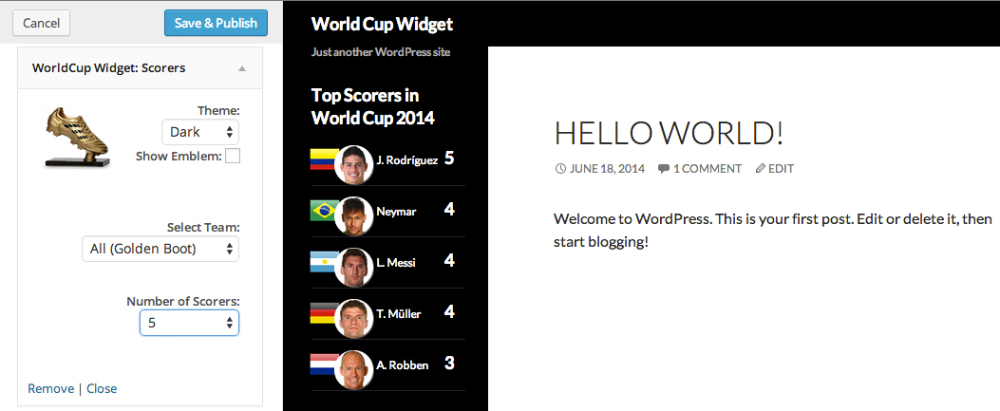

# WorldCup Widget

**Contributors:** ericnkatz

**Tags:** widget, world cup, worldcup, soccer, futbol

**Made for WordPress**

License: GPLv2 or later.
License URI: http://www.gnu.org/licenses/gpl-2.0.html

Adds a sidebar widget that outputs content like team logo, group standings, record, goal count, points and upcoming schedule.

## Description

Adds a sidebar widget that let's you pick your favorite team, adjust some options and output content like team logo, group standings, record, goal count, points and upcoming schedule.

## Installation

1. Upload `worldcup-widget/` to the `/wp-content/plugins/` directory
2. Activate the plugin through the 'Plugins' menu in WordPress
3. Install Widget to Sidebar of choice.

## Screenshots

#### Main Widget admin and display.

#### Top Scorer Widget admin and display.

## Frequently Asked Questions

#### Do you plan on adding other widgets related to the World Cup to this plugin? ####

Yes, most definitely. At this time I've decided to just release and start rolling updates to include various widgets that might be interesting. If you have an idea for one that you would want to include feel free to create a support topic and I'll try to hammer it out as soon as possible.

## Changelog

### 1.0.2
* Added Top Scorers Widget.

### 1.0.1
* Added missing CSS and Screenshot.

### 1.0.0
* Initial Update. I play on adding more widgets / features to this as the tournament progresses. Possibly shortcodes to embed in pages/posts.
